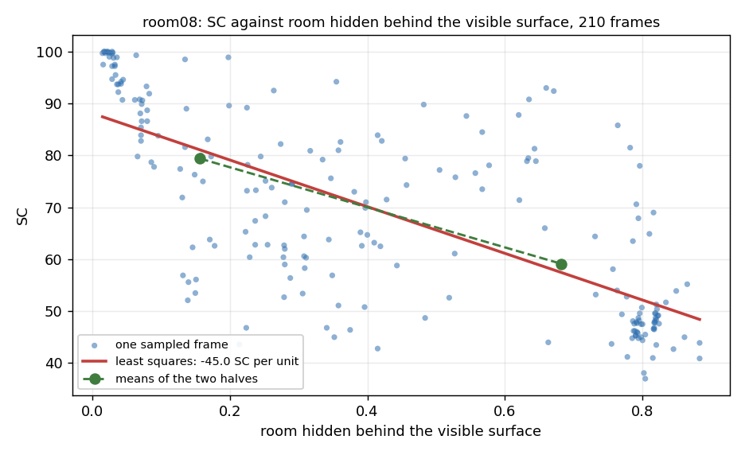

# Evaluation — room08 (camera view only)

Generated 2026-10-08 by `reconstruction_GT/evaluate_gt.py` from `outputs/room08/prediction`, against the ground truth in `captures/room08/gt`. 5 frames.

Protocol is `examples/segmentation/test_NYU.py:206-211`, the same as `inference/document/EVALUATION.md`: **SSC** over voxels where `label_weight > 0` and `label != 255`, mIoU averaged over the classes present; **SC** the same set restricted to `mapping == 307200` — the voxels no depth pixel reached — scored occupied-vs-empty.

`--fov frustum`: only voxels inside the camera view are scored.

| class | TP | FP | FN | precision | recall | IoU |
| --- | ---: | ---: | ---: | ---: | ---: | ---: |
| `empty` *(not in mIoU)* | 3376 | 3525 | 232 | 48.9% | 93.6% | 47.3% |
| `ceiling` | 310 | 142 | 39 | 68.6% | 88.8% | 63.1% |
| `floor` | 287 | 435 | 0 | 39.8% | 100.0% | 39.8% |
| `wall` | 2671 | 547 | 1162 | 83.0% | 69.7% | 61.0% |
| `window` | 757 | 147 | 1020 | 83.7% | 42.6% | 39.3% |
| `bed` | 2082 | 404 | 2432 | 83.7% | 46.1% | 42.3% |
| `sofa` | 0 | 462 | 0 | 0.0% | 0.0% | 0.0% |
| `table` | 0 | 83 | 0 | 0.0% | 0.0% | 0.0% |
| `tvs` | 0 | 0 | 256 | 0.0% | 0.0% | 0.0% |
| `furn` | 173 | 421 | 555 | 29.1% | 23.8% | 15.1% |
| `objs` | 290 | 266 | 736 | 52.2% | 28.3% | 22.4% |

**SSC mIoU (8 classes present): 35.4**
  Absent from this ground truth, so not averaged: `chair`, `sofa`, `table`.

**SC IoU: 59.6**  |  precision 96.0  recall 61.2  |  12687 voxels, 72% of them occupied

NYU test for reference: SSC 47.7, SC 75.0 (`--nyu` reproduces both).

## Error budget

What is known to be wrong with the numbers above, and by how much. Measured, not estimated; `document/DRIFT_AND_ALIGNMENT.md` has the method for each row.

| term | size | effect on the score |
| --- | ---: | --- |
| **annotation fidelity** — a box standing in for real furniture | 36–56 mm | **the dominant term.** Not a placement error: it is what the ground truth *defines*, so it cannot be corrected, only annotated more finely (`shape: mesh`, smaller solids) |
| frame pose vs the reconstruction | 5–9 mm, corrected on 4 frames | ±0.1 SSC |
| sensor depth noise, single frame | 8–13 mm plane RMS | inside the row above |
| reconstruction self-consistency | ≤2.6 mm | fusing the whole sweep smears a wall by no more than this over one frame's view of it, so the reconstruction is not warped |
| trajectory drift, whole sweep | 156–175 mm | **cancels.** It is a near-global change of world frame, and everything scored here is relative: the annotation and each frame's grid live in the same reconstruction |
| camera height: tape vs floor-plane fit | ~60 mm | the tape's, not the geometry's — the two rooms disagree in *opposite* directions, where a scale error would push both the same way |

> The pose correction on 4 frames is a **polish, not a fix**: it was built expecting a ~100 mm error and the error is 5–9 mm, a tenth of a voxel. It is kept because it is measured and recorded (each frame's `pose_refined` block holds its fitness, RMSE and the values it replaced), not because these numbers needed it. Re-run `refine_frame_pose.py` after any `export_frame`, since a freshly exported frame carries the raw tracked pose.

So the figure worth improving is the annotation, not the poses.


## Per frame

The total above pools every frame, which weights every voxel equally -- and the frames with the most occupied SC sets are exactly the ones SC cannot measure, so they dominate it. Read the **margin** column instead: SC minus what "predict occupied everywhere" scores on that frame's own set, which is its occupancy. Positive means the model beat the trivial answer.

| frame | scored voxels | SC set | occupied | SC | margin | SSC | classes |
| --- | ---: | ---: | ---: | ---: | ---: | ---: | ---: |
| `live_000000` | 6746 | 5707 | 82% | 58.6 | -23.1 | 33.3 | 6 |
| `live_000180` | 3285 | 2190 | 57% | 82.6 | **+25.5** | 35.7 | 6 |
| `live_000235` | 1522 | 1194 | 96% | 41.4 | -54.2 | 25.9 | 6 |
| `live_000240` | 1483 | 1161 | 98% | 54.6 | -43.2 | 34.0 | 6 |
| `live_000580` | 3342 | 2435 | 37% | 61.6 | **+25.1** | 29.0 | 6 |

Measuring completion here (positive margin): `live_000180` (+25.5), `live_000580` (+25.1). Those are the only frames whose SC is worth quoting; NYU's own margins run +12.6 to +23.2 by band, for scale.

**What the occupancy figure is, and is not.** It counts only voxels INSIDE the annotated room: everything beyond the shell is 255 and enters neither side of the fraction. So it does not say the room is full -- it says how much of the hidden volume within these walls is furniture and wall interior, which rises as the room gets smaller, because a camera standing in a small room sees nearly all of its free space. It is a measurement of the ANNOTATION, and the shell is the lever: on room07, growing the shell 0.3 m each way moves it from 97.6% to 68.1%, and 0.6 m to 43.0%, without touching a single piece of furniture (wall thickness barely matters: 4 cm vs 2 cm gives 97.6% vs 97.5%). Growing the shell is not a legitimate fix -- those voxels are outside the room, and calling them empty would assert free space where there is a wall. The honest shell sits at the walls, and this number is its consequence.

**SSC is not affected by it.** SSC averages per-class IoU over the classes present and leaves `empty` out of that average, so a mostly-occupied set is what it wants rather than a defect, and most of its set is genuinely hidden -- it measures completion, not visible segmentation.

## Across the sweep

`reconstruction_GT/sweep_eval.py` scored **210 frames** of this room against the same annotation (`outputs/room08/sweep_eval.csv`). One frame gives one number, and that number says as much about the viewpoint as about the model.

| | SC | SSC |
| --- | ---: | ---: |
| best | 100.0 | 65.1 |
| median | 67.1 | 35.0 |
| worst | 34.9 | 17.9 |

`margin` is SC minus what "predict occupied everywhere" would score on that frame, which is its `occupied` column. **Only 32 of 210 frames beat that baseline**, and 96 have a scored set over 90% occupied — in a small room most viewpoints leave the metric nothing to find.

### Best 5 viewpoints (by margin)

| frame | cam z | tilt | hidden | SC set | occupied | SC | margin | SSC |
| ---: | ---: | ---: | ---: | ---: | ---: | ---: | ---: | ---: |
| `live_000180` | 1.16 m | 5.9° | 0.29 m | 2158 | 56.5% | 81.7 | +25.1 | 36.6 |
| `live_000580` | 1.39 m | 16.0° | 0.42 m | 2411 | 35.7% | 60.3 | +24.6 | 29.1 |
| `live_000570` | 1.35 m | 6.8° | 0.44 m | 2533 | 39.1% | 63.2 | +24.1 | 25.4 |
| `live_000555` | 1.21 m | 9.4° | 0.48 m | 2370 | 34.9% | 57.1 | +22.3 | 17.9 |
| `live_000565` | 1.31 m | 7.5° | 0.46 m | 2629 | 35.8% | 57.3 | +21.5 | 30.8 |

### Worst 5 viewpoints

| frame | cam z | tilt | hidden | SC set | occupied | SC | margin | SSC |
| ---: | ---: | ---: | ---: | ---: | ---: | ---: | ---: | ---: |
| `live_000095` | 0.60 m | 4.9° | 0.80 m | 5969 | 85.7% | 40.9 | -44.9 | 25.7 |
| `live_000230` | 1.08 m | 28.9° | 0.32 m | 1499 | 93.9% | 48.9 | -44.9 | 33.0 |
| `live_000310` | 1.01 m | 31.9° | 0.84 m | 3455 | 80.5% | 34.9 | -45.6 | 29.0 |
| `live_000825` | 1.17 m | 21.4° | 0.14 m | 951 | 100.0% | 52.5 | -47.5 | 33.5 |
| `live_000235` | 1.06 m | 29.3° | 0.25 m | 1185 | 95.3% | 40.7 | -54.5 | 27.1 |

> The highest **raw** SC in the sweep is 100.0, on frame live_000645 — whose scored set is 100% occupied, i.e. 472 voxels of solid furniture with nothing empty to find. Rank by `margin`, not by SC.

## What separates a good viewpoint from a bad one

Over these 210 frames SC and SSC correlate **+0.18**, so the two are barely related: ranking the viewpoints by one does not rank them by the other.

Correlation of each measured property of the shot with the two scores. These are measurements of THIS room, not general claims:

The numbers are Pearson correlations, not percentages: **+1** means the score rises in step with that property, **-1** that it falls in step, **0** that there is no straight-line relationship. Squaring one gives the share of the spread it accounts for, so +0.70 is about half of it and +0.30 about a tenth. They are associations, not causes, and they only see straight lines -- a property that helps up to a point and hurts after it (the bands below) reports near zero.

The **per step** columns are the same relationship in this room's own units: the slope of the least-squares line through the frames, read over the step in the second column. It is the correlation with the units left in (slope = r x std(score) / std(property)), so it says what the score did ON AVERAGE across the sweep as that property changed -- not what any one frame would score, and only inside the range the sweep covered.

| property of the viewpoint | a step of | vs SC | SC per step | vs SSC | SSC per step |
| --- | --- | ---: | ---: | ---: | ---: |
| camera height above the floor | +10 cm | +0.68 | +5.0 | +0.05 | +0.2 |
| how far the camera looks down | +5 deg | +0.04 | +0.4 | +0.25 | +1.1 |
| median distance to what it sees | +10 cm | +0.41 | +1.7 | -0.16 | -0.3 |
| share of the frame closer than 1.5 m | +10 points | -0.57 | -4.2 | +0.15 | +0.5 |
| room hidden behind the visible surface | +10 cm | -0.73 | -4.5 | -0.15 | -0.4 |
| size of the SC set | +1000 voxels | -0.64 | -6.0 | -0.21 | -0.9 |
| how much of the SC set is occupied | +10 points | +0.46 | +5.5 | +0.13 | +0.7 |

The shot property that moves SC most here is **room hidden behind the visible surface** (-0.73, about 53% of the spread in SC); for SSC it is **how far the camera looks down** (+0.25, about 6%). Geometry explains SC more than SSC (mean |correlation| 0.51 against 0.16) -- the mean of the absolute values down each column.

Even the strongest of them leaves a lot unexplained: frames scatter 12.9 SC either side of its line, against an SC range of 35 to 100 across the sweep. These are trends over 210 frames, not rules for one.

Those rows are not separate effects either. The properties move together, so a strong correlation in one row is often the same relationship seen from another angle:

| | camera height above the floor | how far the camera looks down | median distance to what it sees | share of the frame closer than 1.5 m | room hidden behind the visible surface | size of the SC set | how much of the SC set is occupied |
| --- | ---: | ---: | ---: | ---: | ---: | ---: | ---: |
| camera height above the floor | +1.00 | +0.39 | +0.29 | -0.44 | -0.83 | -0.89 | +0.00 |
| how far the camera looks down | +0.39 | +1.00 | -0.64 | +0.51 | -0.15 | -0.43 | -0.05 |
| median distance to what it sees | +0.29 | -0.64 | +1.00 | -0.89 | -0.42 | -0.13 | -0.00 |
| share of the frame closer than 1.5 m | -0.44 | +0.51 | -0.89 | +1.00 | +0.53 | +0.29 | -0.18 |
| room hidden behind the visible surface | -0.83 | -0.15 | -0.42 | +0.53 | +1.00 | +0.93 | -0.28 |
| size of the SC set | -0.89 | -0.43 | -0.13 | +0.29 | +0.93 | +1.00 | -0.14 |
| how much of the SC set is occupied | +0.00 | -0.05 | -0.00 | -0.18 | -0.28 | -0.14 | +1.00 |

The tightest pair here is **room hidden behind the visible surface** and **size of the SC set** at +0.93: close enough to be largely one measurement, so the table above cannot say which of the two a score is really following.

The mechanism is the SC set itself: the voxels no depth pixel reached. Group the frames by how much room is hidden behind what they see --

| hidden room behind the surface | frames | median | SC set | occupied | SC | SSC |
| --- | ---: | ---: | ---: | ---: | ---: | ---: |
| least (bottom 25%) | 55 | 0.05 m | 590 | 99% | 93.4 | 34.3 |
| 25-50% | 50 | 0.25 m | 1199 | 94% | 67.1 | 40.8 |
| 50-75% | 52 | 0.54 m | 3452 | 86% | 66.8 | 34.8 |
| most (top 25%) | 53 | 0.81 m | 5852 | 85% | 48.3 | 33.7 |

And the two ends of the ranking, as medians of the best and worst tenth by `margin`:

| | best 10% | worst 10% |
| --- | ---: | ---: |
| camera height (m) | 1.26 | 1.01 |
| tilt (deg) | 14.00 | 20.90 |
| median depth (m) | 2.10 | 1.60 |
| closer than 1.5 m (%) | 28.10 | 45.80 |
| hidden room behind surface (m) | 0.29 | 0.77 |
| SC set (voxels) | 1919.00 | 3455.00 |
| SC set occupied (%) | 44.20 | 86.00 |
| SC | 63.20 | 46.90 |
| SSC | 30.10 | 33.50 |

What the two ends differ in most, largest first: **how much of the SC set is occupied** (44.20 against 86.00); **room hidden behind the visible surface** (0.29 against 0.77); **median distance to what it sees** (2.10 against 1.60).

> 32 of 210 viewpoints beat the trivial baseline. The ones that do are the frames where the hidden volume is neither inside a solid (nothing to find) nor enormous (too much to guess); on this room that is a median depth of 2.10 m against 1.60 m for the worst tenth.


### The same thing measured on the benchmarks

NYU (what CleanerS was trained and evaluated on) and Occ-ScanNet, put through this identical measurement: NYU 654 frames, ScanNet 1500 frames.


**Correlation with SC**

| property of the viewpoint | here | NYU | ScanNet |
| --- | ---: | ---: | ---: |
| camera height above the floor | +0.68 | +0.01 | -0.10 |
| how far the camera looks down | +0.04 | +0.18 | -0.10 |
| median distance to what it sees | +0.41 | -0.15 | +0.01 |
| share of the frame closer than 1.5 m | -0.57 | +0.01 | -0.02 |
| room hidden behind the visible surface | -0.73 | +0.08 | +0.08 |
| size of the SC set | -0.64 | -0.36 | -0.47 |
| how much of the SC set is occupied | +0.46 | +0.39 | +0.56 |
| **mean \|correlation\|** | **0.51** | **0.17** | **0.19** |

**Correlation with SSC**

| property of the viewpoint | here | NYU | ScanNet |
| --- | ---: | ---: | ---: |
| camera height above the floor | +0.05 | +0.05 | -0.07 |
| how far the camera looks down | +0.25 | +0.11 | -0.13 |
| median distance to what it sees | -0.16 | -0.11 | +0.02 |
| share of the frame closer than 1.5 m | +0.15 | +0.00 | -0.01 |
| room hidden behind the visible surface | -0.15 | +0.08 | +0.13 |
| size of the SC set | -0.21 | -0.13 | -0.24 |
| how much of the SC set is occupied | +0.13 | +0.03 | +0.26 |
| **mean \|correlation\|** | **0.16** | **0.07** | **0.12** |

Viewpoint matters far more here than in the benchmarks (mean |correlation| with SC 0.51 against 0.18). The rows above therefore describe this capture, not the metric: in a large scene the shot barely predicts the score.

| | this room | NYU | ScanNet |
| --- | ---: | ---: | ---: |
| median camera height | 1.06 m | 1.34 m | 1.43 m |
| median distance to the scene | 1.67 m | 2.49 m | 1.77 m |
| median room hidden behind the surface | 0.36 m | 1.72 m | 1.64 m |
| median SC set occupied | 87% | 55% | 45% |
| median SC set | 2038 voxels | 10811 voxels | 6226 voxels |

The gap that drives the rest is **how much room is hidden behind what the camera sees**: NYU 1.72 m, ScanNet 1.64 m, this room 0.36 m. A frame that hides nothing cannot be asked to complete anything, and a room too small to hide anything cannot produce such a frame.

### Worked example: room hidden behind the visible surface



Each dot is one sampled frame: where the camera was on that axis, and what CleanerS scored on it. The red line is the least-squares fit, and the slope of that line is the `per step` column.

Every frame contributes one product to the covariance: how far it sits from the average on each axis, multiplied. Both above average, or both below, and the product is positive; one of each and it is negative. Their average is the covariance, which still carries the units of both axes, so dividing by the two standard deviations strips the units out and pins the result between -1 and +1. That is r.

```
room hidden behind the visible surface mean    0.424   std    0.302
SC                           mean     68.9   std     18.8

cov    = mean((property - its mean) x (SC - its mean))
       = -4.1465
r      = cov / (std(property) x std(SC))
       = -4.1465 / (0.3025 x 18.80)
       = -0.7292
slope  = r x std(SC) / std(property)
       = -0.7292 x 18.8 / 0.302
       = -45.3 SC per unit
step   = +10 cm  ->  -45.3 x 0.1 = -4.5 SC per step
```

The same answer without fitting anything, as a check: split the 210 frames at the median room hidden behind the visible surface and compare the halves.

```
lower half: mean 0.156 -> mean SC 79.9
upper half: mean 0.693 -> mean SC 57.9
-21.9 SC over +0.537  ->  -4.1 SC per step (fit said -4.5)
```

That is the green dashed line on the plot. The two agree, so the number is not an artefact of the fit -- but the frames scatter 12.9 SC either side of the line, so it describes the sweep as a whole and predicts no single frame.

### How these were measured

Per frame, in `reconstruction_GT/sweep_eval.py` (`viewpoint_stats`), on the same 640x480 crop the model is given:

- **median distance** and **closer than 1.5 m**: the depth image itself, over valid pixels.
- **floor**: those pixels unprojected with the frame's tracked pose, counted where world z < 12 cm. Recorded in the CSV, but deliberately kept OUT of the correlations above: a room shot from standing height has almost no floor in any frame, and a room where it varies varies it by lowering the camera, which is already a column of its own.
- **hidden room behind the visible surface**: each depth pixel is a ray; it is continued past the surface it hit to where it leaves the ANNOTATED room shell, and the mean of that remaining distance is taken. Zero when the ray dies on a wall or inside furniture, large when it dies on the near side of something with space behind it. Measured against the room in `gt/solids.json`, not against the fused surface, so it is the same volume the ground truth describes.
- **SC set** and **occupied**: the scored set itself -- `label_weight > 0`, `label != 255`, `mapping == 307200` -- and the share of it the ground truth calls occupied, which is what a model predicting "occupied" everywhere would score.

Correlations are Pearson over the 210 sampled frames. They describe this room; a larger room, or one shot from a doorway, would spread differently.

These are scored in memory as the sweep runs, against the same ground truth and the same protocol; where a frame was also written to disk and scored from its files, the two agree to 0.2 SC. `--keep N` writes the N best and N worst out in full -- frame, ground truth, prediction and plys -- and they are the `live_...` rows in the per-frame table above.
